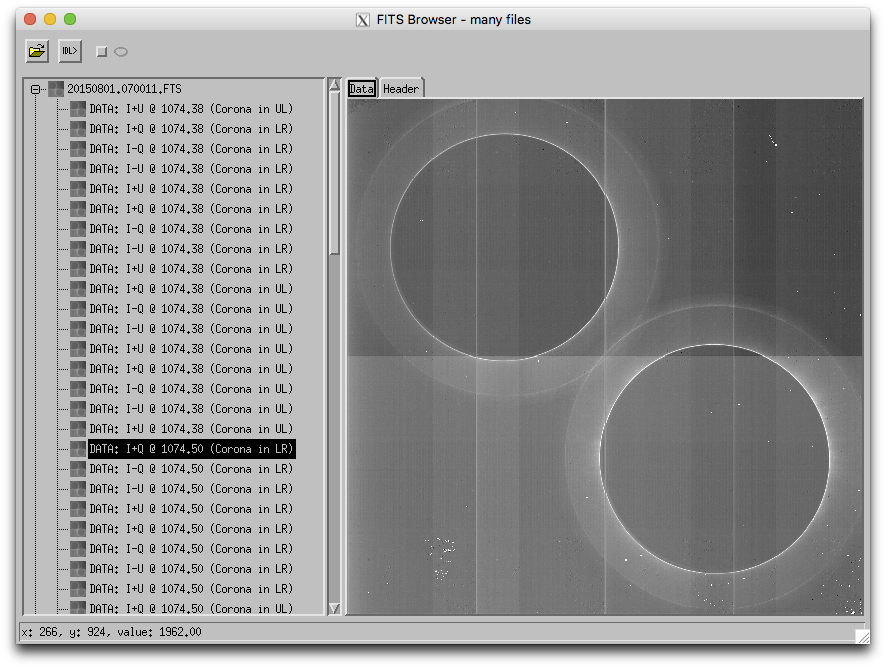
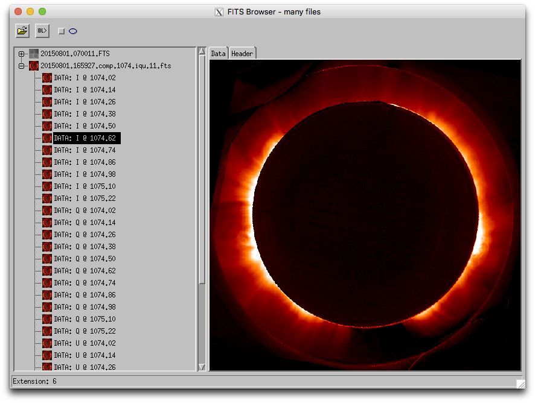
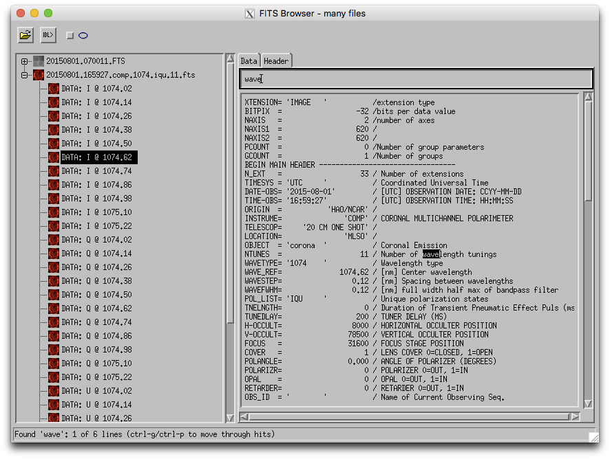
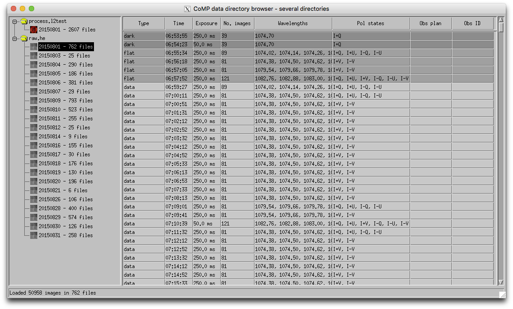
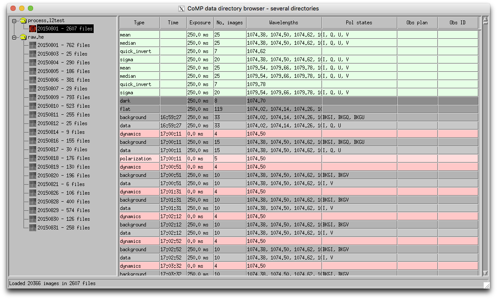
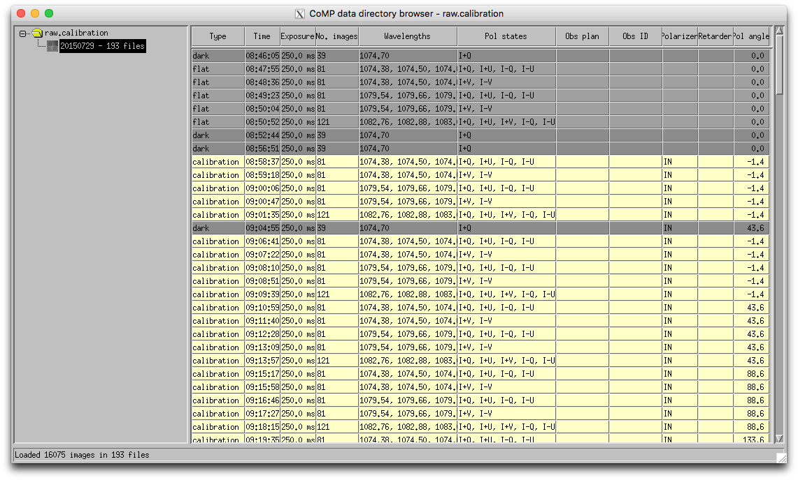

# CoMP utilities

Utilities for analyzing and visualizing CoMP data

    IDL> comp_browser, 'raw.he/20150801/20150801.070011.FTS'

    IDL> comp_browser, 'process.l2test/20150801/20150801.165927.comp.1074.iqu.11.fts'

    IDL> comp_dir_browser, 'process.l2test'
    IDL> comp_dir_browser, 'raw.he'

