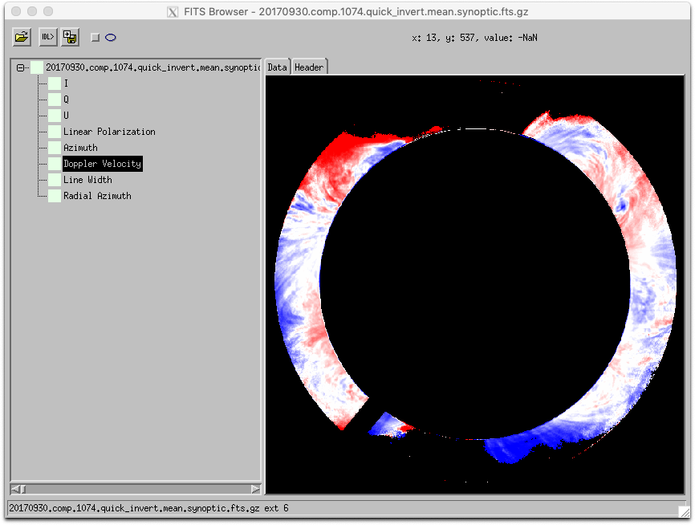
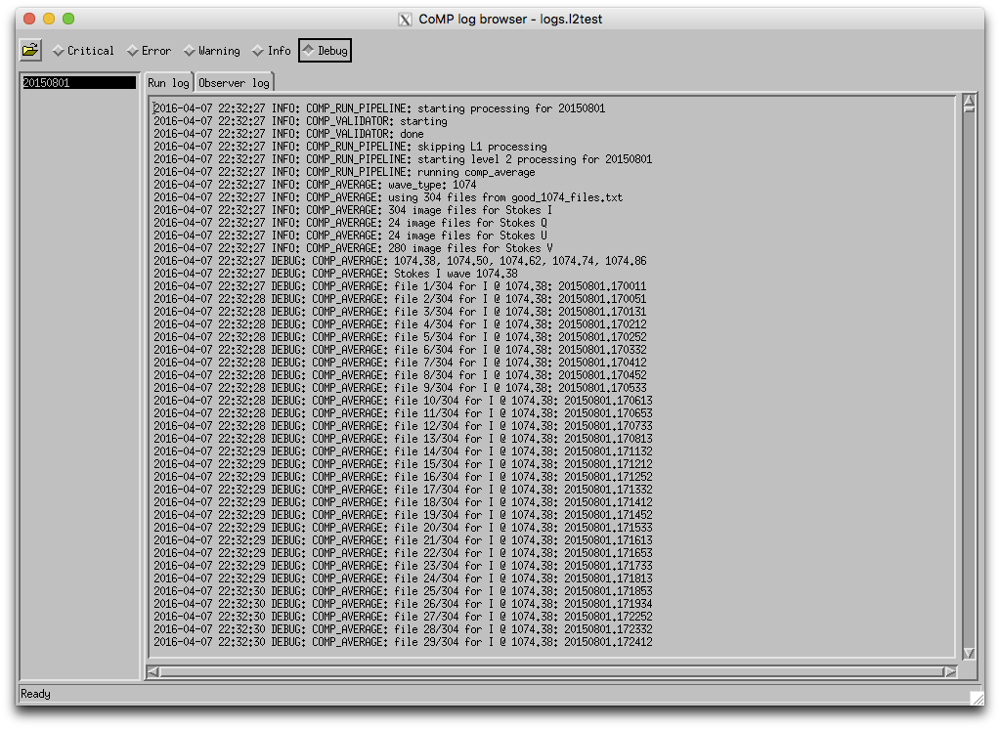

# CoMP utilities

This library contains routines for analyzing and visualizing various aspects of CoMP data.

## Installation

To install, add the `src`, `lib`, and `ssw` directories of this repository to your IDL `!path`. This can be done using the `IDL_PATH` environment variable or setting the `IDL_PATH` preference using the `PREF_SET` routine. See the IDL documentation for more information about setting your IDL path.

## COMP_BROWSER

To examine a raw, L1, or L2 FITS data file, use `COMP_BROWSER`:

    IDL> comp_browser, 'process.l2test/20150801/20150801.165927.comp.1074.iqu.11.fts'

This presents a list of the extensions in the file. The data can be displayed using the standard visualization settings used in the pipeline to produce images. The Level 1 data is displayed as:

The primary and extension headers can also be displayed for any FITS file. Below, the header is searched for text using the search box above the header:

Use control-G and control-P to cycle forward and backward through the occurrences of the search text.

The toolbar at the top of the browser window has several useful features:

  1.  Open another CoMP FITS file.
  2.  Export the current displayed data to the IDL command line. If the current selection is display of image, then it will be exported to the variable "data". If it is a header, it will be exported as "header".
  3.  Export the current image display as an image file. A dialog will pop up to select a output filename and location.
  4.  Overlay annotations on the image display.

A couple of features are possible directly from the display.

  1. Right-click on an image to display spectral plot and select "Plot spectral profile" to plot all the wavelengths for the current selection at the selected pixel, as well as the neighboring pixels.

  2. Two images can be compared by selecting the base extension image to compare, then holding down the control key while selecting another extension. Now that two images are displayed, moving the mouse in the image display while holding the left mouse button down will give a base display of the first image and an inset of the second image.

`COMP_BROWSER` can also display all level 2 data in the same manner that GIFs are made in the standard processing pipeline. For example, a doppler extension from a quick invert file can be displayed:

    IDL> comp_browser, '20170930.comp.1074.quick_invert.mean.synoptic.fts.gz'
    

Raw data files can also be browsed in the same manner:

    IDL> comp_browser, 'raw.he/20150801/20150801.070011.FTS'

The raw data is displayed as:

## COMP_DIR_BROWSER

CoMP data, both raw and processed, is generally organized by date directories inside a top-level directory.

    raw.he
    ├── 20150801
    ├── 20150803
    ...
    ├── 20150830
    └── 20150831

`COMP_DIR_BROWSER` is used to quickly browse this directory and provide an inventory of the contents for each date. For example, to load the *process.l2test* directory containing only one day of Level 2 data, use:

    IDL> comp_dir_browser, 'process.l2test'

Similarly, *raw.he*, containing a months worth of data, is opened in the same manner:

    IDL> comp_dir_browser, 'raw.he'

Selecting a date in the *raw.he* list shows the raw FITS data files (typically only darks, flats, and science images for raw data) in chronological order for the day:

Files are color coded by type. For instance, for raw data files, dark files are dark grey, flat files are a medium gray, and science data files are the default background color.

A directory of processed data, such as one from *process.l2test*, can contain many types of FITS output files:

Right clicking on a file or selection of files brings up a context menu to display those files in a `COMP_BROWSER` window for further examination.

It is useful to use the `CALIBRATION` keyword when displaying raw calibration to show a few extra calibration related columns:

    IDL> comp_dir_browser, 'raw.calibration', /calibration

## COMP_LOG_BROWSER

The pipeline output logs and observer logs can be displayed with `COMP_LOG_BROWSER`:

    IDL> comp_log_browser, 'logs.l2test', observer_log_dir='/hao/ftp/d5/mlso/log/observer'

The log browser can filter the output log messages by severity. This allows jobs to be run with a verbose logging setting (such as DEBUG), but to display only a more restrictive set of messages chosen later.

The log browser updates its content automatically, so it can be used to monitor currently running jobs.

## COMP_RUN_BROWSER

The inputs and outputs of a CoMP pipeline run is determined by a configuration file. To display the input and output files using `COMP_DIR_BROWSER` and the output log files using `COMP_LOG_BROWSER`, pass the configuration file used for the run to `COMP_RUN_BROWSER`:

    IDL> comp_run_browser, 'config/comp.mgalloy.compdata.l2test.cfg'
